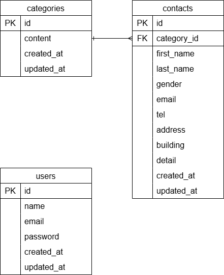

# アプリケーション名
お問い合わせフォーム付き管理システム

## 環境構築手順
1. このリポジトリをクローン  
   `git clone git@github.com:sugamura-aya/contact-admin-system.git`
2. Dockerイメージをビルド  
   `docker-compose up -d --build`
3. PHPコンテナにログイン  
   `docker-compose exec php bash`
4. パッケージインストール  
   `composer install`
5. .env.exampleを.envにコピーして、以下の内容に変更  
   ```env
   DB_HOST=mysql  
   DB_DATABASE=laravel_db  
   DB_USERNAME=laravel_user  
   DB_PASSWORD=laravel_pass
6. docker-compose.yml ファイル内の php: に以下を追記
   ```yaml
   user: "1000:1000"
8. アプリキーの生成  
   `php artisan key:generate`
9. マイグレーション実行  
   `php artisan migrate`
10. ダミーデータ投入（ファクトリ使用）  
    `php artisan db:seed`

## 使用技術・実行環境
このアプリケーションは Laravel と Docker を用いて構築しています。
- Laravel 8.75（composer.json 参照）
- PHP 8.0（Docker）
- MySQL 8.0（Docker）
- Docker / Docker Compose
※より詳細な環境情報は composer.json および docker-compose.yml をご参照ください。

## ER図
※ ER図は下記画像を参照  


## URL
- アプリ起動URL：`http://localhost/`  
- 管理画面URL：`http://localhost/admin`

## 実装状況メモ
- お問い合わせフォーム入力ページ：完了
- お問い合わせフォーム確認ページ：完了
- サンクスページ：完了
- 管理画面：完了
- ユーザー登録ページ：完了
- ログインページ：完了
- 検索フォーム：完了  
- 削除機能：完了（動作確認済）  
- 詳細画面：**仮表示（モーダルは未実装）**  
- CSVエクスポート：**未実装**
